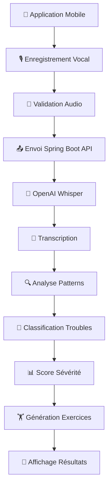

<p align="center">
  
</p>

# AI-VoiceTherapy : Rééducation Vocale Assistée par Intelligence Artificielle

[](https://android.com)
[](https://java.com)
[](https://spring.io/projects/spring-boot)
[](https://android-arsenal.com/api?level=21)
[](https://openai.com/research/whisper)
[](https://github.com/NisrineLachguer/AI-VoiceTherapy/releases)

> AI-VoiceTherapy est une application mobile innovante dédiée au suivi autonome et à la rééducation des troubles de la parole, utilisant l'intelligence artificielle pour analyser la voix et proposer des exercices thérapeutiques personnalisés.

## 📋 Table des Matières

- [Description](#-description)
- [Fonctionnalités](#-fonctionnalités)
- [Technologies](#-technologies)
- [Architecture](#️-architecture)
- [Captures d'écran](#-captures-décran)
- [Installation](#-installation)
- [Utilisation](#-utilisation)
- [Troubles Détectés](#-troubles-détectés)
- [Exercices Thérapeutiques](#-exercices-thérapeutiques)
- [Limitations](#-limitations)
- [Améliorations Futures](#-améliorations-futures)
- [Roadmap](#️-roadmap)
- [Contribution](#-contribution)
- [Équipe](#-équipe)

## 🗣️ Description

AI-VoiceTherapy est une solution révolutionnaire qui exploite l'intelligence artificielle pour démocratiser l'accès à la rééducation vocale. En utilisant le modèle Whisper d'OpenAI, l'application peut analyser automatiquement les enregistrements vocaux pour détecter divers troubles de la parole et proposer des exercices thérapeutiques adaptés.

### 🎯 Pourquoi AI-VoiceTherapy ?

- **🏥 Détection automatique** : Analyse intelligente des troubles de la parole
- **🌍 Accessibilité universelle** : Thérapie vocale disponible partout
- **⚡ Suivi personnalisé** : Exercices adaptés à chaque utilisateur
- **💰 Solution économique** : Alternative abordable aux séances d'orthophonie
- **🔬 Base scientifique** : Utilisation du modèle Whisper d'OpenAI

### 🌟 Impact Thérapeutique

AI-VoiceTherapy révolutionne l'accès aux soins orthophoniques, particulièrement dans les zones à ressources limitées. La plateforme favorise l'autonomie du patient, réduit la dépendance aux consultations fréquentes et constitue un outil précieux pour la télémédecine et le suivi thérapeutique.

## 🚀 Fonctionnalités

### 🎙️ Enregistrement et Analyse Vocale

- Capture haute qualité des échantillons vocaux
- Transcription automatique via OpenAI Whisper
- Analyse en temps réel des patterns de parole
- Interface intuitive d'enregistrement

### 🧠 Diagnostic IA Avancé

| Technologie          | Fonction                    | Capacité                    |
| -------------------- | --------------------------- | --------------------------- |
| **OpenAI Whisper**   | Transcription vocale        | Multi-langues, haute précision |
| **Analyse Pattern**  | Détection anomalies         | Classification troubles     |
| **Spring Boot**      | Backend intelligent         | API REST performante        |
| **Scoring System**   | Évaluation sévérité         | Échelle 0-10                |

### 📊 Suivi Thérapeutique Complet

- **Détection multi-troubles** : Bégaiement, Dysphasie, Dysarthrie, Apraxie
- **Exercices personnalisés** : Adaptés au trouble détecté
- **Suivi des progrès** : Historique et évolution
- **Rapports détaillés** : Score de sévérité et recommandations

## 🛠️ Technologies

### 📱 Frontend Mobile (Android)

```
☕ Java - Développement natif Android
🎨 Material Design - Interface moderne
🔄 Retrofit 2.9.0 - Communication API REST
📡 HTTP Client - Échange données sécurisé
💾 MVC Architecture - Code maintenable
🎵 Android Audio API - Enregistrement optimisé
🔧 Gson - Sérialisation JSON
```

### 🍃 Backend Intelligence (Spring Boot)

```
🚀 Spring Boot - Framework Java moderne
🔐 Spring Security - Authentification JWT
💾 Spring Data JPA - Persistence ORM
🗄️ MySQL - Base de données relationnelle
🧠 OpenAI Whisper API - Analyse vocale IA
📊 Hibernate - Mapping objet-relationnel
⚡ REST API - Communication client-serveur
```

### 🤖 Intelligence Artificielle

```
🗣️ OpenAI Whisper - Reconnaissance vocale avancée
📈 Pattern Analysis - Détection anomalies vocales
🎯 Classification ML - Identification troubles
📐 Signal Processing - Traitement audio numérique
🔍 Transcription AI - Conversion parole-texte
📊 Severity Scoring - Évaluation quantitative
```

## 🏗️ Architecture

### 🔄 Flux de Données Thérapeutique



### 🏛️ Architecture 3-Tiers

| Couche                | Responsabilité           | Technologies                 |
| --------------------- | ------------------------ | ---------------------------- |
| **🎨 Présentation**   | Interface utilisateur    | Android SDK, Material Design |
| **💼 Logique Métier** | MVC, Services REST       | Spring Boot, JWT             |
| **🗄️ Persistance**    | Gestion données          | MySQL, JPA/Hibernate        |
| **🧠 Intelligence**   | Analyse IA               | OpenAI Whisper API           |

## 📱 Captures d'écran

<div align="center">
<table>
  <tr>
    <td align="center">
      
      <br><strong>🔐 Inscription</strong><br>
      <sub>Création compte sécurisé</sub>
    </td>
    <td align="center">
      
      <br><strong>🏠 Connexion</strong><br>
      <sub>Authentification utilisateur</sub>
    </td>
    <td align="center">
      
      <br><strong>🎙️ Enregistrement</strong><br>
      <sub>Capture échantillon vocal</sub>
    </td>
    <td align="center">
      
      <br><strong>🏋️ Exercices</strong><br>
      <sub>Thérapie personnalisée</sub>
    </td>
  </tr>
</table>
</div>

### 🎯 Parcours Utilisateur en 4 Étapes

1. **🔐 Authentification** : Connexion sécurisée à l'espace personnel
2. **🎙️ Enregistrement** : Capture d'échantillon vocal de qualité
3. **🧠 Analyse IA** : Traitement automatique via Whisper
4. **🏋️ Rééducation** : Exercices adaptés aux troubles détectés

## 📦 Installation

### ⚙️ Prérequis Système

| Composant      | Version Minimale      | Recommandée   |
| -------------- | --------------------- | ------------- |
| **📱 Android** | API 21+ (Android 5.0) | API 30+       |
| **☕ Java**    | JDK 8+                | JDK 11+       |
| **🍃 Spring**  | Spring Boot 2.7+      | Spring Boot 3.0+ |
| **🗄️ MySQL**   | 8.0+                  | 8.0+          |
| **💾 RAM**     | 3GB                   | 6GB+          |
| **🔊 Audio**   | Microphone intégré    | Micro externe |

### 🚀 Installation Complète

#### 1. **📥 Clonage du Repository**

```bash
git clone https://github.com/NisrineLachguer/AI-VoiceTherapy.git
cd AI-VoiceTherapy
```

#### 2. **🗄️ Configuration Base de Données**

```sql
-- Création base de données MySQL
CREATE DATABASE ai_voice_therapy;
CREATE USER 'therapy_user'@'localhost' IDENTIFIED BY 'secure_password';
GRANT ALL PRIVILEGES ON ai_voice_therapy.* TO 'therapy_user'@'localhost';
FLUSH PRIVILEGES;
```

#### 3. **🍃 Configuration Backend Spring Boot**

Modifiez `src/main/resources/application.properties`:

```properties
# Configuration Base de Données
spring.datasource.url=jdbc:mysql://localhost:3306/ai_voice_therapy
spring.datasource.username=therapy_user
spring.datasource.password=secure_password
spring.jpa.hibernate.ddl-auto=update
spring.jpa.database-platform=org.hibernate.dialect.MySQL8Dialect

# Configuration OpenAI
openai.api.key=YOUR_OPENAI_API_KEY
openai.whisper.model=whisper-1

# Configuration JWT
jwt.secret=votre_cle_secrete_jwt
jwt.expiration=86400000
```

#### 4. **🚀 Lancement du Backend**

```bash
# Compilation et démarrage Spring Boot
cd backend
./mvnw spring-boot:run

# Vérification API
curl http://localhost:8080/api/health
```

#### 5. **📱 Configuration Mobile Android**

Dans `app/src/main/java/config/ApiConfig.java`:

```java
public class ApiConfig {
    public static final String BASE_URL = "http://VOTRE_IP:8080/api/";
    public static final int CONNECT_TIMEOUT = 30;
    public static final int READ_TIMEOUT = 30;
}
```

#### 6. **🔐 Permissions Android**

Dans `AndroidManifest.xml`:

```xml
<!-- 🎙️ Enregistrement audio -->
<uses-permission android:name="android.permission.RECORD_AUDIO" />
<uses-permission android:name="android.permission.WRITE_EXTERNAL_STORAGE" />
<uses-permission android:name="android.permission.READ_EXTERNAL_STORAGE" />

<!-- 🌐 Communication réseau -->
<uses-permission android:name="android.permission.INTERNET" />
<uses-permission android:name="android.permission.ACCESS_NETWORK_STATE" />
```

## 📖 Utilisation

### 🎯 Guide Utilisateur Complet

#### **Étape 1 : 🔐 Inscription/Connexion**

1. Ouvrez l'application AI-VoiceTherapy
2. Créez un compte avec vos informations personnelles
3. Connectez-vous avec vos identifiants

#### **Étape 2 : 🎙️ Enregistrement Vocal**

1. Accédez à l'interface d'enregistrement
2. Positionnez le smartphone près de la bouche (15-20cm)
3. Appuyez sur "Démarrer l'enregistrement"
4. Parlez clairement pendant 10-30 secondes
5. Arrêtez l'enregistrement

#### **Étape 3 : 🧠 Analyse IA**

- L'application envoie automatiquement l'audio à Whisper
- Transcription et analyse des patterns vocaux
- Classification du type de trouble
- Attribution d'un score de sévérité (0-10)

#### **Étape 4 : 📊 Résultats et Exercices**

- **📋 Diagnostic** : Type de trouble détecté et sévérité
- **🏋️ Exercices** : Programme personnalisé adapté
- **📈 Suivi** : Évolution et progression dans le temps

## 🩺 Troubles Détectés

### 🔍 Capacités de Diagnostic

| Trouble              | Description                          | Symptômes Analysés                    |
| -------------------- | ------------------------------------ | ------------------------------------- |
| **🗣️ Bégaiement**    | Perturbation fluidité parole         | Répétitions, blocages, prolongations  |
| **🧠 Dysphasie**     | Trouble développement langage        | Syntaxe, vocabulaire, compréhension   |
| **💭 Dysarthrie**    | Trouble moteur parole                | Articulation, débit, intelligibilité |
| **🎯 Apraxie**       | Trouble programmation motrice        | Séquences motrices, coordination      |
| **🔄 Troubles Mixtes** | Combinaison plusieurs troubles      | Patterns complexes multiples          |

### 📊 Système de Scoring

- **0-2** : **🟢 Léger** - Exercices de maintenance
- **3-5** : **🟡 Modéré** - Programme intensif recommandé  
- **6-8** : **🟠 Sévère** - Suivi professionnel conseillé
- **9-10** : **🔴 Très Sévère** - Consultation urgente nécessaire

## 🏋️ Exercices Thérapeutiques

### 📚 Types d'Exercices Disponibles

#### 🔨 **Construction de Phrases**
- **🎯 Objectif** : Améliorer structure grammaticale
- **⏱️ Durée** : 15 minutes
- **🔄 Fréquence** : 3 fois/semaine
- **📋 Progression** : Phrases simples → complexes

#### 🖼️ **Association Mot-Image**
- **🎯 Objectif** : Renforcer vocabulaire
- **⏱️ Durée** : 10 minutes
- **🔄 Fréquence** : Quotidien
- **📋 Progression** : Mots isolés → phrases descriptives

#### 🗣️ **Exercices Articulatoires**
- **🎯 Objectif** : Améliorer prononciation
- **⏱️ Durée** : 20 minutes
- **🔄 Fréquence** : 2 fois/jour
- **📋 Progression** : Phonèmes → mots → phrases

#### 🎵 **Exercices Prosodiques**
- **🎯 Objectif** : Travailler rythme et intonation
- **⏱️ Durée** : 12 minutes
- **🔄 Fréquence** : 4 fois/semaine
- **📋 Progression** : Syllabes → mots → phrases mélodiques

### 🎧 Fonctionnalités Exercices

- **🔊 Audio guide** : Instructions vocales claires
- **📱 Interface intuitive** : Navigation simple
- **✅ Suivi progression** : Statut "Complété" / "En cours"
- **📊 Statistiques** : Temps d'entraînement et régularité

## 🔒 Limitations

### ⚠️ Limitations Techniques

- **🩺 Outil d'aide** : Ne remplace pas un diagnostic médical professionnel
- **🔊 Qualité audio** : Sensible aux bruits environnementaux
- **🌐 Connexion requise** : Nécessite internet pour analyse Whisper
- **📱 Compatibilité** : Android uniquement (iOS en développement)

### 👥 Limitations d'Usage

- **🎯 Population cible** : Optimisé pour francophones adultes
- **🔋 Consommation** : Usage intensif de la batterie
- **💾 Stockage** : Enregistrements vocaux occupent l'espace
- **🔐 Confidentialité** : Données audio traitées par OpenAI

## 🔮 Améliorations Futures

### 🚀 Développements Prioritaires

- **🌍 Multi-langues** : Support arabe dialectal et amazighe
- **📱 Version iOS** : Extension plateforme Apple
- **🔊 Traitement local** : Réduction dépendance réseau
- **👶 Mode pédiatrique** : Adaptation troubles enfants

### 🧠 Améliorations IA

- **⚡ Temps réel** : Analyse vocale instantanée
- **😊 Analyse émotionnelle** : Détection état psychologique
- **📈 ML personnalisé** : Apprentissage utilisateur individuel
- **🔍 Diagnostic différentiel** : Distinction troubles similaires

## 🗺️ Roadmap

### 📅 Version 1.1 (Q3 2025)

- [ ] 🌍 **Multi-langues** : Arabe dialectal, Amazighe
- [ ] 📱 **Version iOS** : Application iPhone/iPad
- [ ] ☁️ **Sync Cloud** : Sauvegarde automatique données
- [ ] 👨‍⚕️ **Tableau de bord pro** : Interface orthophonistes

### 📅 Version 1.5 (Q4 2025)

- [ ] ⚡ **Analyse temps réel** : Feedback instantané
- [ ] 👶 **Mode enfants** : Interface et exercices adaptés
- [ ] 🎮 **Gamification** : Système points et récompenses
- [ ] 📊 **Analytics avancés** : Rapports détaillés progression

### 📅 Version 2.0 (2026)

- [ ] 🧠 **IA locale** : Traitement sur appareil
- [ ] 🏥 **Intégration HIS** : Systèmes hospitaliers
- [ ] 🔬 **Recherche** : Contribution études scientifiques
- [ ] 🌐 **API publique** : Plateforme développeurs

### 🔬 Vision Long Terme

- [ ] 🤖 **IA prédictive** : Anticipation rechutes
- [ ] 📡 **IoT thérapeutique** : Objets connectés santé
- [ ] 🌍 **Plateforme globale** : Réseau orthophonistes mondial
- [ ] 🧬 **Médecine personnalisée** : Thérapie sur mesure

## 🤝 Contribution

### 🌟 Comment Contribuer

Nous accueillons toutes les contributions pour améliorer AI-VoiceTherapy !

#### 🔧 **Types de Contributions**

1. **🐛 Correction bugs** : Signalement et résolution problèmes
2. **✨ Nouvelles fonctionnalités** : Ajout capacités application
3. **📚 Documentation** : Amélioration guides utilisateur
4. **🧪 Tests** : Validation fonctionnalités existantes
5. **🌍 Traductions** : Support nouvelles langues

#### 📋 **Process Contribution**

1. **🍴 Fork** le repository
2. **🌿 Branche** : `git checkout -b feature/nom-fonctionnalite`
3. **💾 Développement** : Code + tests + documentation
4. **✅ Tests** : Validation locale complète
5. **📤 Pull Request** : Description détaillée changements

#### 🎯 **Domaines Prioritaires**

- 🧠 **Algorithmes IA** : Amélioration précision diagnostic
- 🎵 **Traitement audio** : Optimisation qualité analyse
- 🏥 **Validation médicale** : Tests avec professionnels
- 🌍 **Accessibilité** : Support populations diverses
- 📱 **UX/UI** : Amélioration expérience utilisateur

## 👥 Équipe

### 👩‍💻 Développeuses Principales

<table>
  <tr>
    <td align="center">
      <br>
      <sub><b>Nissrine Lachguer</b></sub><br>
      <sub>🎓 Étudiante Ingénieure 4ᵉ année</sub><br>
      <sub>École Marocaine des Sciences de l'Ingénieur</sub><br>
      <sub>📧 nisrinelachguer37@gmail.com</sub>
    </td>
    <td align="center">
      <br>
      <sub><b>Ourda Azizi</b></sub><br>
      <sub>🎓 Étudiante Ingénieure 4ᵉ année</sub><br>
      <sub>École Marocaine des Sciences de l'Ingénieur</sub><br>
      <sub>📧 Ourdaazizi2@gmail.com</sub>
    </td>
  </tr>
</table>

### 🎓 Institution

**École Marocaine des Sciences de l'Ingénieur (EMSI)**

- 📍 Marrakesh, Morocco  
- 🌐 [Site Web EMSI](https://www.emsi.ma)
- 🎯 Formation Ingénierie Informatique et Réseaux
- 🔬 Spécialisation Intelligence Artificielle

### 🏆 Spécialisations Projet

- **🧠 Intelligence Artificielle** : OpenAI Whisper, ML
- **📱 Développement Mobile** : Android natif, UX/UI
- **🍃 Architecture Backend** : Spring Boot, API REST
- **🗄️ Gestion Données** : MySQL, JPA/Hibernate
- **🩺 Domaine Médical** : Troubles parole, orthophonie

## 🌐 Liens Utiles

- **💻 Code Source** : [GitHub Repository](https://github.com/NisrineLachguer/AI-VoiceTherapy.git)
- **📱 Application** : [Google Play Store](https://play.google.com/store/apps/details?id=com.aivoicetherapy) _(à venir)_
- **📊 API Documentation** : [Spring Boot Docs](http://api.ai-voicetherapy.ma/swagger-ui.html) _(développement)_
- **🎓 Article Scientifique** : [ResearchGate](https://researchgate.net/ai-voicetherapy-paper) _(soumission)_

---

## 📚 Citation Académique

```bibtex
@article{lachguer2025aivoicetherapy,
  title={AI-VoiceTherapy: Application Mobile de Suivi Vocal Assisté par Intelligence Artificielle},
  author={Lachguer, Nissrine and Azizi, Ourda},
  journal={École Marocaine des Sciences de l'Ingénieur},
  year={2025},
  institution={EMSI Marrakesh},
  url={https://github.com/NisrineLachguer/AI-VoiceTherapy.git}
}
```

---

## 📜 Licence

Ce projet est sous licence MIT. Voir le fichier [LICENSE](LICENSE) pour plus de détails.

---

<div align="center">

## 🗣️ **Révolutionnez Votre Rééducation Vocale avec AI-VoiceTherapy** 🗣️

[](https://github.com/NisrineLachguer/AI-VoiceTherapy)
[](https://github.com/NisrineLachguer/AI-VoiceTherapy)
[](https://github.com/NisrineLachguer/AI-VoiceTherapy)

### 🏆 **Analyse IA Avancée | 🌍 Accessible Partout | 💪 Rééducation Autonome**

---

_"Démocratiser l'accès à la rééducation vocale grâce à l'Intelligence Artificielle"_

**🎓 Projet Académique EMSI Marrakesh | 🇲🇦 Made in Morocco with ❤️**

---

### 📞 Contact & Support

- **💬 Questions** : [Issues GitHub](https://github.com/NisrineLachguer/AI-VoiceTherapy/issues)
- **📧 Support** : nisrinelachguer37@gmail.com | Ourdaazizi2@gmail.com
- **🐛 Bug Reports** : [Bug Tracker](https://github.com/NisrineLachguer/AI-VoiceTherapy/issues/new?template=bug_report.md)
- **💡 Feature Requests** : [Feature Requests](https://github.com/NisrineLachguer/AI-VoiceTherapy/issues/new?template=feature_request.md)

</div>
